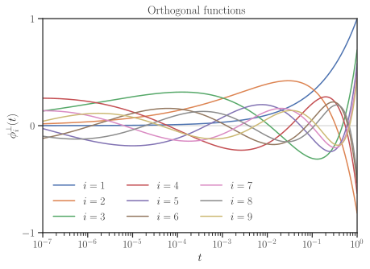

### Description

This script generates a set of orthonormal functions, called , based on the set of non-orthonormal functions  defined by

<p align="center">
  
</p>

The orthonormalized functions  are the linear combination of the functions  by

<p align="center">
	
</p>

The functions  are orthonormal in the interval  with respect to the weight function . That is,
        
 <p align="center">
	
</p>

where  is the Kronecker delta function. The orthogonal functions are generated by [Gram-Schmidt orthogonalization process](https://en.wikipedia.org/wiki/Gram%E2%80%93Schmidt_process). This script produces the symbolic functions using [Sympy](https://www.sympy.org), a Python computer algebraic package.

### Package Prerequisits

The Python packages that are required are `numpy`, `sympy`, and `matplotlib`. If you are using [anaconda](https://www.anaconda.com/) or [miniconda](https://docs.conda.io/en/latest/miniconda.html) python distirbutions in Linux environment, these Python packages can be installed by

    $ sudo conda install -c conda-forge numpy sympy matplotlib -y

### Usage

	$ python GenerateOrthogonalFunctions.py [options]
Optional arguments:

| Option| Description |
| -- | ----- |
| `-h`, `--help`                  | Prints a help message. |
| `-v`, `--version`               | Prints version. |
| `-l`, `--license`               | Prints author info, citation and license. |
| `-n`, `--num-func[=int]`        | Number of orthogonal functions to generate. Positive integer. Default is 9. |
| `-s`, `--start-func[=int]`      | Starting function index. Non-negative integer. Default is 1. |
| `-e`, `--end-interval[=float]`  | End of the interval of functions domains. Real number greater than zero. Default is 1. |
| `-c`,`--check`                  | Checks orthogonality of generated functions. |
| `-p`, `--plot`                  | Plots generated functions, also saves the plot as pdf file in the current directory.|

The variables , , and  can be set in the script by the following arguments,

| Variable | Variable in script    |          Option            |
| -------- |  -------------------- |  ------------------------- |
|         | `StartFunctionIndex`  | `-s`, or `--start-func` |
|         | `NumFunctions`        | `-n`, or `--num-func`     |
|         | `EndInterval`         | `-e`, or `--end-interval`  |

### Examples

1. Generate nine orthogonal functions from index 1 to 9 (defaults)

       $ python GenerateOrthogonalFunctions.py

2. Generate eight orthogonal functions from index 1 to 8

       $ python GenerateOrthogonalFunctions.py -n 8

3. Generate nine orthogonal functions from index 0 to 8

       $ python GenerateOrthogonalFunctions.py -s 0

4. Generate nine orthogonal functions that are orthonormal in the interval [0,10]

       $ python GenerateOrthogonalFunctions.py -e 10

4. Check orthogonality of each two functions, plot the orthonormal functions and save the plot to pdf

       $ python GenerateOrthogonalFunctions.py -c -p

5. A complete example:

       $ python GenerateOrthogonalFunctions.py -n 9 -s 1 -e 1 -c -p
       
### Output

* Displays the orthogonal functions as computer algebraic symbolic functions. An example a set of generated functions is shown below.

```
Function 1:  sqrt(x)
Function 2:  sqrt(6)*(5*x**(1/3) - 6*sqrt(x))/3
Function 3:  sqrt(2)*(21*x**(1/4) - 40*x**(1/3) + 20*sqrt(x))/2
Function 4:  sqrt(10)*(84*x**(1/5) - 210*x**(1/4) + 175*x**(1/3) - 50*sqrt(x))/5
Function 5:  sqrt(3)*(330*x**(1/6) - 1008*x**(1/5) + 1134*x**(1/4) - 560*x**(1/3) + 105*sqrt(x))/3
Function 6:  sqrt(14)*(1287*x**(1/7) - 4620*x**(1/6) + 6468*x**(1/5) - 4410*x**(1/4) + 1470*x**(1/3) - 196*sqrt(x))/7
Function 7:  5005*x**(1/8)/2 - 10296*x**(1/7) + 17160*x**(1/6) - 14784*x**(1/5) + 6930*x**(1/4) - 1680*x**(1/3) + 168*sqrt(x)
Function 8:  sqrt(2)*(19448*x**(1/9) - 90090*x**(1/8) + 173745*x**(1/7) - 180180*x**(1/6) + 108108*x**(1/5) - 37422*x**(1/4) + 6930*x**(1/3) - 540*sqrt(x))/3
Function 9:  sqrt(5)*(75582*x**(1/10) - 388960*x**(1/9) + 850850*x**(1/8) - 1029600*x**(1/7) + 750750*x**(1/6) - 336336*x**(1/5) + 90090*x**(1/4) - 13200*x**(1/3) + 825*sqrt(x))/5
```

* Displays readable coefficients,  and  of the functions. For instance,

```
  i      alpha_i                                    a_[ij]
------  ----------   -----------------------------------------------------------------------
i = 1:  +sqrt(2/2)   [1                                                                    ]
i = 2:  -sqrt(2/3)   [6,   -5                                                              ]
i = 3:  +sqrt(2/4)   [20,  -40,    21                                                      ]
i = 4:  -sqrt(2/5)   [50,  -175,   210,   -84                                              ]
i = 5:  +sqrt(2/6)   [105, -560,   1134,  -1008,   330                                     ]
i = 6:  -sqrt(2/7)   [196, -1470,  4410,  -6468,   4620,   -1287                           ]
i = 7:  +sqrt(2/8)   [336, -3360,  13860, -29568,  34320,  -20592,   5005                  ]
i = 8:  -sqrt(2/9)   [540, -6930,  37422, -108108, 180180, -173745,  90090,  -19448        ]
i = 9:  +sqrt(2/10)  [825, -13200, 90090, -336336, 750750, -1029600, 850850, -388960, 75582]
```
* Displays a matrix of mutual inner product of functions to check orthogonality (using option `-c`). An examle of generated matrix is shown below.

```
[[1 0 0 0 0 0 0 0 0]
 [0 1 0 0 0 0 0 0 0]
 [0 0 1 0 0 0 0 0 0]
 [0 0 0 1 0 0 0 0 0]
 [0 0 0 0 1 0 0 0 0]
 [0 0 0 0 0 1 0 0 0]
 [0 0 0 0 0 0 1 0 0]
 [0 0 0 0 0 0 0 1 0]
 [0 0 0 0 0 0 0 0 1]]
```

*Plots the set of functions (using option `-p`) and saves the plot in the directory`./doc/images/OrthogonalFunctions.pdf`. An example of a generated plot is shown below.

<p align="center">

</p>

### Credits

__Author:__

   Siavash Ameli (University of California, Berkeley)

__Citation:__

   Ameli, S. and Shadden. S. C. (2020). Maximum Likelihood Estimation of Variance and Nugget in General Linear Model.

__License:__ [GNU General Public License v3.0](https://www.gnu.org/licenses/gpl-3.0.en.html)
